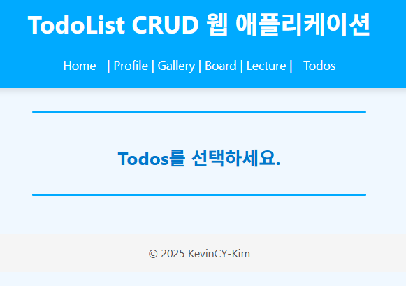
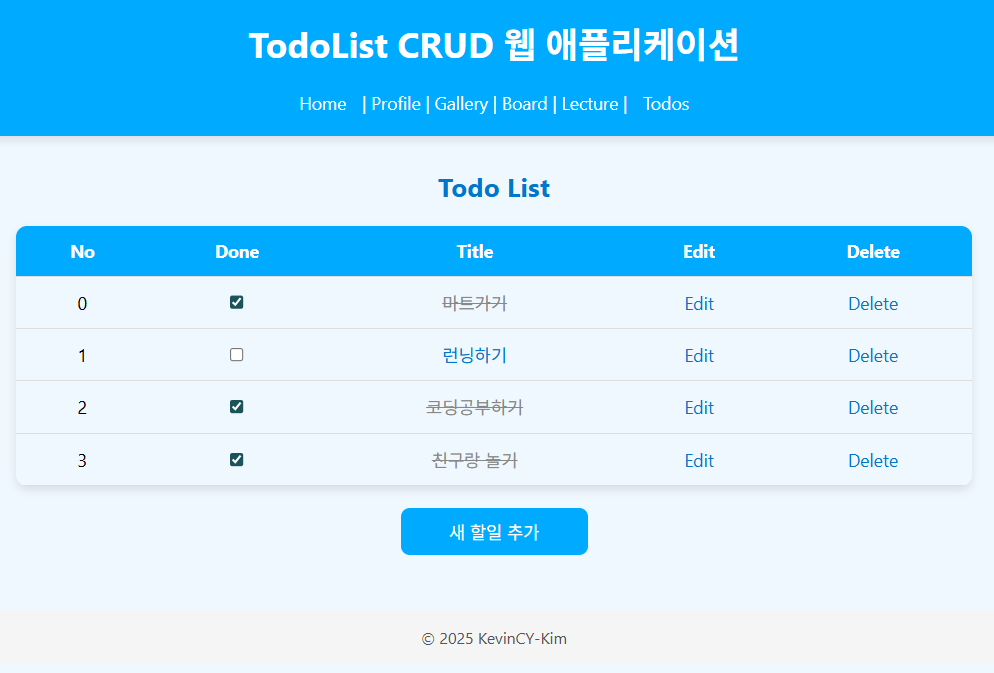
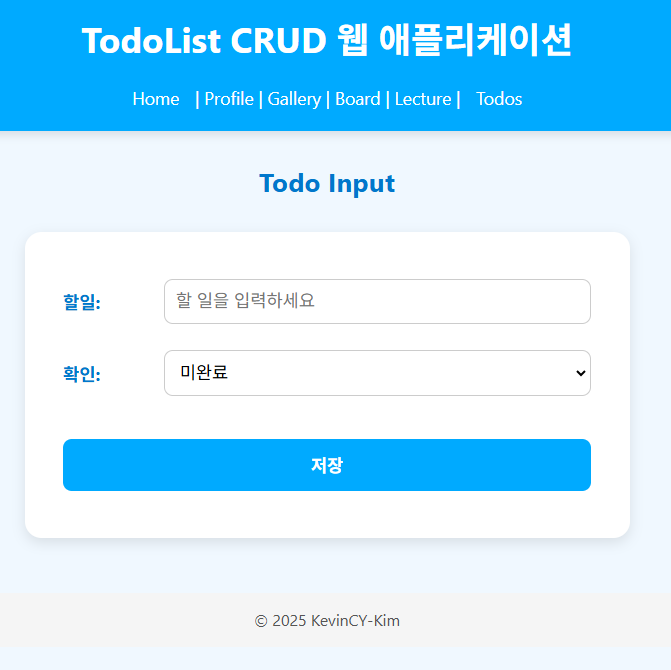
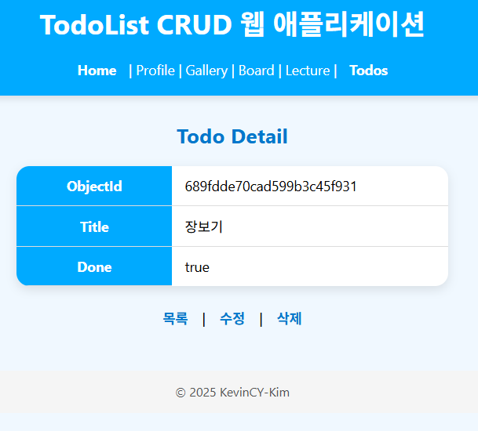
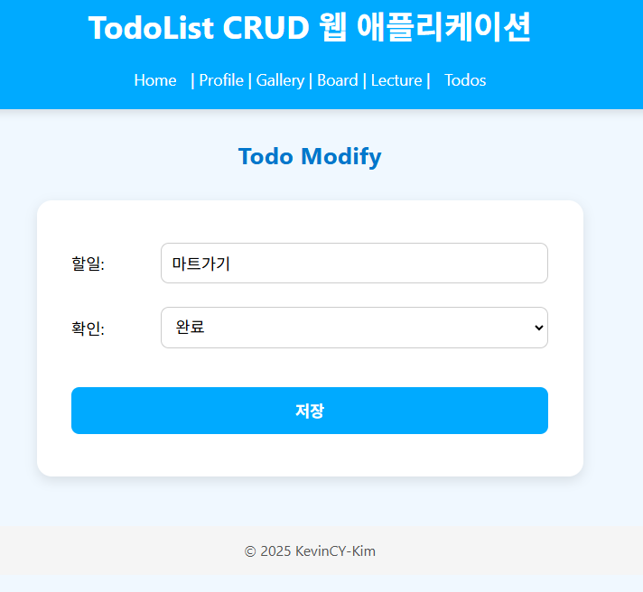

# TodoList with MongoDB & Express

> 산토리니 감성의 시원한 UI를 가진 **TodoList CRUD 웹 애플리케이션**  
> Node.js + Express + MongoDB + EJS 기반으로 제작

---

## 프로젝트 개요

이 프로젝트는 **할 일 관리 (TodoList)** 기능을 중심으로  
CRUD(Create, Read, Update, Delete)를 학습 및 구현하기 위한 풀스택 예제입니다.  

UI는 **산토리니 풍 디자인**을 적용하여, 깔끔하고 시원한 느낌을 주도록 구성했습니다.  

---

## 주요 기능

- 할 일 목록 보기
- 새 할 일 추가
- 상세 조회
- 수정
- 삭제
- Done 체크 시 실시간 취소선 반영 + DB 업데이트

---

## 기술 스택

- **Frontend:** EJS, CSS, JavaScript (Vanilla)
- **Backend:** Node.js, Express
- **Database:** MongoDB (Mongoose ODM)
- **Template Engine:** EJS
- **Runtime:** Node.js (v18+)

---

## UI 미리보기

> 전체적으로 **산토리니 테마**를 적용하여 시원한 파란색과 흰색 위주의 색감 사용  

### 홈 화면


### Todo List


### Todo Input


### Todo Detail / Modify



### MongoDBconnection


## 폴더 구조
```bash
todosCRUD_webapp/
│  app.js
│  index.js           # Express 서버 진입점
│  package-lock.json
│  package.json
│
├─docs
│  └─screenshots      # UI 스크린샷
│          home.png
│          tododetail.png
│          todoinput.png
│          todolist.png
│          todomodify.png
│          todomodify.png
├─public
│      index.html     # 정적 파일 (CSS, JS)
└─views               # EJS 템플릿
    │  home.ejs
    │  TodoDetail.ejs
    │  TodoInput.ejs
    │  Todolist.ejs
    │  TodoModify.ejs
    └─inc
           Bottom.ejs
           Top.ejs


